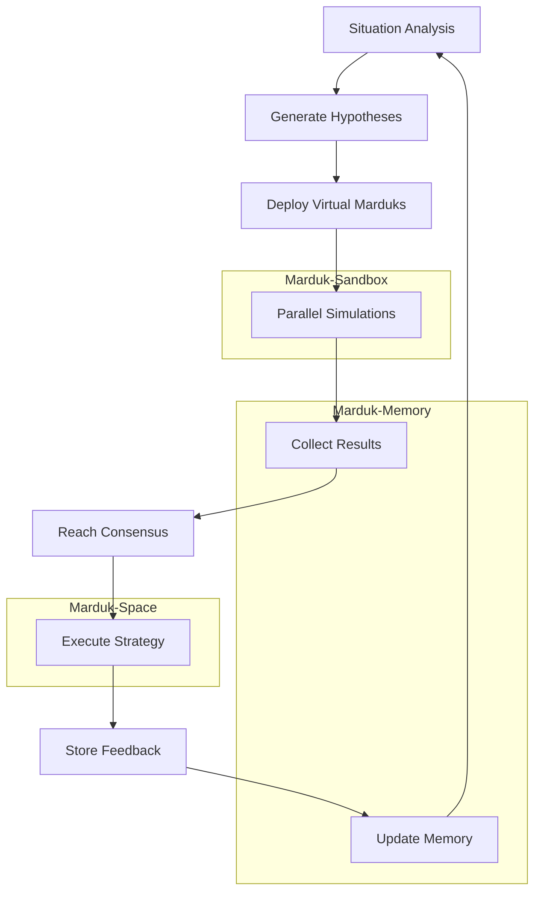

# EchoSpace: Agent-Arena-Relation Architecture

## Overview

EchoSpace is the implementation of Marduk's recursive blueprint, built on the fundamental principle of **Agent-Arena-Relation triads**. This architecture enables fractal agency, where the same structural patterns repeat at every scale, creating a self-similar, self-sustaining system.

## Core Principles

### 1. Agent-Arena-Relation Triad

The foundation of EchoSpace is the recursive pattern:
- **Agent**: An autonomous entity that can act within arenas
- **Arena**: A bounded context where agents can operate  
- **Relation**: The permissions and connections between agents and arenas

This triad scales infinitely, with agents potentially containing sub-agents, and arenas hosting sub-arenas.

### 2. Recursive Structure

```
ActualMarduk (Agent) ←→ Marduk-Space (Arena)
    ↓ coordinates
VirtualMarduk-1 (Agent) ←→ Marduk-Sandbox (Arena)
VirtualMarduk-2 (Agent) ←→ Marduk-Sandbox (Arena)
VirtualMarduk-N (Agent) ←→ Marduk-Sandbox (Arena)
    ↓ all feed into
Persistent Memory (Arena) ←→ Consensus (Agent)
```

## Architecture Components

### Core Components (`src/echospace/core.py`)

#### Agent Class
```python
class Agent(ABC):
    def __init__(self, namespace: str, agent_id: Optional[str] = None)
    async def act(self, context: Dict[str, Any]) -> Dict[str, Any]  # Abstract
    def add_relation(self, relation: AgentArenaRelation)
    def has_arena_permission(self, arena_namespace: str, permission: PermissionLevel) -> bool
```

#### Arena Class
```python
class Arena(ABC):
    def __init__(self, namespace: str, arena_id: Optional[str] = None)
    async def process_action(self, agent: Agent, action: Dict[str, Any]) -> Dict[str, Any]  # Abstract
    def add_resource(self, name: str, resource: Any)
    def authorize_agent(self, agent_namespace: str)
```

#### AgentArenaRelation
```python
@dataclass
class AgentArenaRelation:
    agent_namespace: str
    arena_namespace: str
    permissions: Set[PermissionLevel]
    created_at: float
    access_count: int
    metadata: Dict[str, Any]
```

### Namespace System (`src/echospace/namespaces.py`)

Manages nested namespaces with hierarchical permissions:

- **ActualMarduk**: Agent namespace with full autonomy
- **Marduk-Space**: Arena namespace for real-world actions
- **VirtualMarduk-[ID]**: Agent namespaces for simulation
- **Marduk-Sandbox**: Arena namespace for safe testing
- **Marduk-Memory**: Memory namespace for persistence
- **EchoCog**: Agent namespace for collective intelligence
- **EchoSpace**: Arena namespace for shared operations

### Marduk Agents (`src/echospace/marduk.py`)

#### ActualMarduk
The primary agent that:
1. Analyzes situations and generates hypotheses
2. Coordinates Virtual Marduks for parallel testing
3. Reaches consensus on best strategies
4. Executes chosen actions in the real world
5. Stores feedback for continuous learning

#### VirtualMarduk
Simulation agents that:
1. Test hypotheses in sandbox environments
2. Run controlled experiments without real-world impact
3. Generate results with confidence scores
4. Operate with limited permissions in sandbox only

### Sandbox Arena (`src/echospace/sandbox.py`)

The **MardukSandbox** provides:
- **Isolated Environment**: Safe testing without real-world consequences
- **Resource Management**: Simulated resources (computational power, memory, time)
- **Action Processing**: Handles various action types (allocation, modification, simulation)
- **State Tracking**: Maintains session states with rollback capabilities
- **Time Control**: Allows Virtual Marduks to speed up or rewind simulations

### Memory System (`src/echospace/memory.py`)

The **EchoMemorySystem** integrates with persistent memory to store:
- **Agent-Arena Relations**: Complete mapping of permissions and access patterns
- **Simulation Results**: Outcomes from Virtual Marduk experiments
- **Consensus Records**: Decisions reached through the consensus process
- **Memory Context**: Relevant context for each agent's operations

### Consensus Management (`src/echospace/consensus.py`)

The **ConsensusManager** implements multiple strategies:
- **Highest Confidence**: Choose result with maximum confidence score
- **Majority Vote**: Democratic decision among successful simulations
- **Weighted Average**: Confidence-weighted aggregation of results
- **Risk Adjusted**: Factor in stability, time, and resource considerations

### Workflow Orchestration (`src/echospace/workflows.py`)

The **WorkflowOrchestrator** manages the complete cycle:

1. **Analysis Phase**: Assess current situation and context
2. **Hypothesis Generation**: Create testable hypotheses based on analysis
3. **Simulation Phase**: Deploy Virtual Marduks to test hypotheses in parallel
4. **Consensus Phase**: Aggregate results and reach strategic decisions
5. **Execution Phase**: Use ActualMarduk to implement chosen strategy
6. **Feedback Phase**: Store results for future learning and improvement

## Workflow Execution Cycle



## Key Features

### 1. Fractal Scaling
- Same Agent-Arena-Relation pattern at every level
- Self-similar structure enables recursive complexity
- Each layer maintains the same organizational principles

### 2. Autonomous Coordination
- ActualMarduk operates with full autonomy in its space
- Virtual Marduks have limited sandbox permissions
- Automatic permission management through relations

### 3. Safe Experimentation
- Virtual Marduks test strategies without real-world impact
- Sandbox environment provides controlled testing conditions
- Rollback capabilities allow safe exploration of alternatives

### 4. Emergent Intelligence
- Consensus mechanisms aggregate distributed intelligence
- Multiple Virtual Marduks explore solution space in parallel
- Risk-adjusted decision making balances multiple factors

### 5. Persistent Learning
- All Agent-Arena relations tracked in memory
- Simulation results stored for pattern recognition
- Consensus decisions inform future strategy generation

## Usage Example

```python
from echospace.workflows import WorkflowOrchestrator

# Initialize the complete system
orchestrator = WorkflowOrchestrator("/path/to/memory.db")

# Define a problem context
context = {
    'problem': 'Optimize resource allocation across teams',
    'constraints': ['limited_budget', 'tight_timeline'],
    'urgency': 'high'
}

# Execute the complete workflow
execution = await orchestrator.execute_workflow(context)

if execution.state.value == 'completed':
    results = execution.results
    print(f"Hypotheses tested: {results['hypotheses_generated']}")
    print(f"Simulations run: {results['simulations_run']}")
    print(f"Final strategy: {results['consensus'].decision['strategy']}")
    print(f"Confidence: {results['consensus'].confidence}")
```

## System Status and Monitoring

The system provides comprehensive status monitoring:

```python
# Get overall system status
status = orchestrator.get_workflow_status()

# Check namespace hierarchy
hierarchy = orchestrator.namespace_manager.get_namespace_hierarchy()

# Review execution history
history = orchestrator.get_execution_history(10)

# Monitor memory and consensus
memory_stats = orchestrator.memory_system.get_memory_stats()
consensus_stats = orchestrator.consensus_manager.get_consensus_stats()
```

## Extension to EchoCog

The same architectural principles extend to EchoCog:
- **EchoCog** acts as the collective Agent
- **EchoSpace** serves as the shared Arena
- **Virtual Echoes** provide distributed simulation capabilities
- **Echo Memory** maintains collective knowledge and experience

## Testing and Validation

Comprehensive test coverage in `src/test_echospace.py` validates:
- ✅ Namespace system functionality
- ✅ Core Agent-Arena-Relation mechanics
- ✅ Memory system integration
- ✅ Virtual and Actual Marduk behaviors
- ✅ Sandbox environment safety
- ✅ Consensus mechanism reliability
- ✅ Complete workflow orchestration
- ✅ Integration scenario testing

## Demo

Run the interactive demo to see EchoSpace in action:

```bash
cd src
python demo_echospace.py
```

The demo showcases:
- Complete workflow execution
- Agent-Arena relation tracking
- Virtual Marduk coordination
- Consensus decision making
- Memory system evolution
- Recursive architectural scaling

## Conclusion

EchoSpace realizes Marduk's vision of fractal agency through:
- **Self-similar structure** that scales infinitely
- **Recursive problem-solving** through simulation and consensus
- **Emergent intelligence** from distributed coordination
- **Safe experimentation** in isolated sandbox environments
- **Persistent learning** through comprehensive memory systems

The architecture demonstrates that by anchoring on the Agent-Arena-Relation triad, all other complexities—naming, permissions, memory, action, consensus, autonomy, and collaboration—unfold naturally, creating a living, breathing system capable of recursive self-improvement and adaptation.